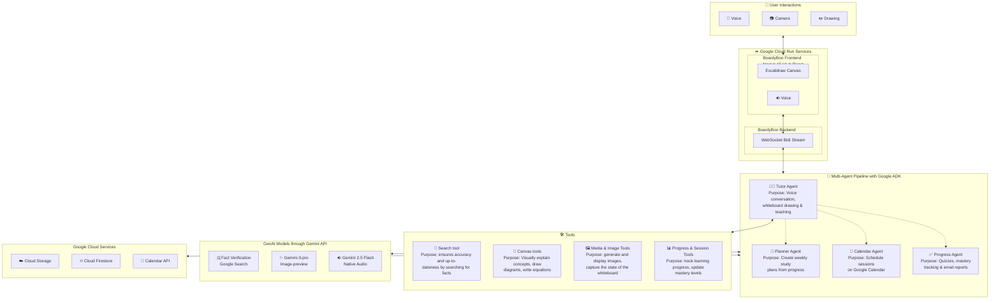

<p align="center">
  
</p>

<h1 align="center">BoardyBoo — AI Whiteboard Tutor</h1>

<p align="center">
  <strong>A real-time, multimodal AI tutor that sees, hears, speaks, and draws — all on an interactive whiteboard.</strong>
  <br />
  <em>Built for the <a href="https://devpost.com/">Gemini Live Agent Challenge</a> · Category: Live Agents 🗣️</em>
</p>

<p align="center">
  
  
  
  
  
</p>


---

## 🎯 The Problem

When I was a child, my mom used to sit with me every evening and help me with my homework. But as I grew older, things changed. She had to focus on my younger brothers, and math at my level became harder for her to teach.

Today, many students turn to AI for help, but it's backfiring. **88% of students use AI for homework**, yet they score **17% worse on tests**. They're getting answers, not learning. (*Sources: HEPI Global Student Survey, 2025 & University of Pennsylvania / Hechinger Report*)

Students are stuck with **static, text-based AI chatbots** that feel like talking to a search engine.

## 💡 The Solution


**BoardyBoo** is an AI tutor that behaves like a real teacher standing at a whiteboard:

- **🗣️ Speaks naturally** — bidirectional voice streaming with interruption support (Gemini 2.5 Flash Native Audio)
- **🎨 Draws in real-time** — animated diagrams, flowcharts, equations, and graphs appear on an Excalidraw canvas *while* the tutor speaks
- **👁️ Sees your work** — point your camera at homework or draw on the canvas; the AI understands and responds
- **🖼️ Generates images** — creates educational illustrations on-the-fly using Gemini 3 Pro Imagen
- **📈 Plots functions** — animated mathematical graphs with axes, ticks, and progressive curve rendering
- **🔍 Grounded in facts** — Google Search integration prevents hallucinations on factual questions
- **📊 Tracks progress** — mastery levels, quizzes, session notes, and study plans persist across sessions

> **This isn't a chatbot with a canvas bolted on — it's an immersive tutoring experience where voice, vision, and drawing work simultaneously.**

---

## 🏗️ Architecture




### Agent Architecture

| Agent | Purpose | Key Tools |
|-------|---------|-----------|
| **🎨 Tutor Agent** (root) | Voice conversation, live whiteboard drawing, teaching, image generation | 7 canvas tools, plot, image gen, Google Search grounding |
| **📋 Planner Agent** | Creates personalised weekly study plans | study plan CRUD, progress data |
| **📅 Calendar Agent** | Schedules sessions on Google Calendar | 5 calendar tools (CRUD + availability) |
| **📊 Progress Agent** | Quizzes, mastery tracking, email reports | quiz results, mastery updates, Gmail |

The **Tutor Agent** is the root of the tree and delegates to 3 specialised sub-agents via ADK's `transfer_to_agent`. All agents use **Gemini 2.5 Flash Native Audio** for natural voice with `StreamingMode.BIDI` via Google ADK's `runner.run_live()`.

### Core Tools

| Tool Category | Description | Tools |
|---------------|-------------|-------|
| 🎨 **Canvas Mechanics** | Core tools for manipulating the Excalidraw whiteboard | `draw_line`, `draw_rectangle`, `draw_circle`, `add_text`, `remove_element`, `clear_canvas`, `highlight_area` |
| 🖼️ **Media & Vision** | Tools for generating graphics and seeing user input | `generate_image (Gemini 3 Pro)` , `capture_canvas_snapshot`, `analyze_camera_feed` |
| 📈 **Math & Logic** | Specialised teaching tools | `plot_function`, `google_search (Grounding)`  |
| 📅 **Scheduling** | Google Calendar integration via Calendar MCP | `list_events`, `create_event`, `update_event`, `delete_event`, `check_availability` |
| 📊 **Progress (Firestore)**| Student data persistence | `update_mastery`, `save_quiz_results`, `create_study_plan`, `get_student_history` |


---

## ✨ Key Technical Innovations

### 1. Early Canvas Push (Zero-Latency Drawing)
Canvas tools are pre-executed on `functionCall` events — the student sees diagrams animating on screen **before** ADK completes the round-trip. Drawing and speech happen simultaneously.

### 2. Canvas Bridge Pattern
Full Excalidraw element arrays are stored in a server-side bridge (keyed by UUID). Only a tiny `deferred_canvas_id` is returned to the LLM, preventing Gemini Live 1007/1008 payload-too-large errors while keeping the visual richness.

### 3. Progressive Animation System
Canvas elements are grouped into `AnimationGroup` slices with staggered delays. Lines grow via endpoint interpolation with ease-out cubic curves. Shapes fade in. Graph curves draw left-to-right in 6 animated slices.

### 4. Camera Vision Input
Students can point their phone/webcam at physical homework. Frames are captured as JPEG, sent over WebSocket, and the AI "sees" and responds — making it a true **vision-enabled tutor**.

### 5. Google Search Grounding
The tutor uses `google_search` to verify facts before teaching, preventing hallucinations on dates, formulas, and definitions — directly addressing the "grounding" judging criterion.

### 6. AudioWorklet Ring Buffer
Low-latency audio I/O using custom AudioWorklet processors with a ring buffer (~3 min capacity at 24kHz). Supports instant playback flush on interruption.

---

## 🛠️ Tech Stack

| Layer | Technology |
|-------|-----------|
| **AI Models** | Gemini 2.5 Flash Native Audio (voice + reasoning), Gemini 3 Pro (image generation) |
| **Agent Framework** | Google ADK 1.25 (Agent, Runner, LiveRequestQueue, FunctionTool) |
| **Backend** | FastAPI + Uvicorn, WebSocket bidi-streaming |
| **Frontend** | Next.js 15, React 19, Excalidraw, Framer Motion |
| **Auth** | Firebase Authentication (Google OAuth + email/password) |
| **Database** | Cloud Firestore (users, sessions, progress, quizzes, study plans, tutors) |
| **Storage** | Google Cloud Storage (canvas snapshots, generated images) |
| **APIs** | Google Calendar API v3, Gmail API v1, Google Search |
| **Deployment** | Google Cloud Run (backend + frontend), Cloud Build |
| **Audio** | AudioWorklet (16kHz capture, 24kHz playback, ring buffer) |

We utilized a modern, serverless, and highly async stack to pull off the real-time multimodal experience:

AI & Agents

Gemini 2.5 Flash Native Audio API: Handled zero-latency, bidirectional audio streaming between the student and the tutor persona.
Gemini 3 Pro Image Preview: Generated contextual images directly onto the canvas.
Google Agent Development Kit (ADK): Orchestrated the entire multi-agent hierarchy (Tutor, Planner, Calendar, Progress), handling tool execution, session management, and seamless handoffs.
Backend Architecture

FastAPI / Uvicorn (Python): The async web framework managing the active WebSocket session and LiveRequestQueue for Gemini.
WebSockets (Bidirectional PCM): Transport layer for sending raw 16kHz audio blobs and JSON payloads (canvas_elements, 
image
) constantly between client and server.
Pydantic: Strictly typed environment parsing schemas for the agent toolsets.
Frontend & User Interface

Next.js 15 (App Router) & React 19: Powered the lightning-fast, reactive dashboard UI and page layouts.
Excalidraw: Embedded as the digital canvas engine. Our backend piped custom JSON elements directly into Excalidraw’s updateScene() API from the LLM.
Framer Motion: Provided smooth UI transitions and states (like the mic spinner and drawing animations).
Google Cloud & Infrastructure

Google Cloud Run: Hosted the containerized FastAPI backend, scaling to zero gracefully when no students are studying.
Firebase Authentication: Secured user accounts allowing students to return to their same study session later.
Firestore (NoSQL): Stored all user progress. We structured data into sub-collections (/users/{uid}/progress, /sessions, /quizzes) to maintain strict data isolation and rapid querying.
Google Cloud Storage: Held the generated and user-scanned canvas snapshots for persistence.
External Integrations

Model Context Protocol (MCP): We stood up local MCP servers to standardize agent integration with external tools (Google Calendar API, Gmail API).
---

## 🚀 Quick Start (Local Development)

### Prerequisites
- Python 3.11+
- Node.js 20+
- A Google Cloud project with Firestore, Storage, and Gemini API enabled
- Firebase project with Authentication enabled
- A Gemini API key

### 1. Clone the repository
```bash
git clone https://github.com/YOUR_USERNAME/BoardyBoo.git
cd BoardyBoo
```

### 2. Backend setup
```bash
cd backend

# Create virtual environment
python -m venv .venv
source .venv/bin/activate  # Windows: .venv\Scripts\activate

# Install dependencies
pip install -r requirements.txt

# Configure environment
cp .env.example .env
# Edit .env with your API keys and Firebase credentials

# Run the backend
uvicorn app.main:app --reload --port 8000
```

### 3. Frontend setup
```bash
cd frontend

# Install dependencies
npm install

# Configure environment
cp .env.example .env.local
# Edit .env.local with your Firebase config and backend URLs

# Run the frontend
npm run dev
```

### 4. Open the app
Navigate to [http://localhost:3000](http://localhost:3000), sign in, and click **Start Session** on the whiteboard page.

---

## ☁️ Cloud Deployment (Google Cloud Run)

### Automated deployment (recommended)
```bash
# Set your project ID
export GOOGLE_CLOUD_PROJECT=your-project-id

# Deploy both services
chmod +x deploy.sh
./deploy.sh
```

This script:
1. Enables all required Google Cloud APIs
2. Builds and deploys the backend to Cloud Run
3. Builds and deploys the frontend to Cloud Run
4. Configures CORS between the services

### Manual deployment
```bash
# Backend
cd backend
gcloud run deploy boardyboo-backend \
  --source . \
  --region us-central1 \
  --allow-unauthenticated \
  --memory 1Gi \
  --timeout 3600 \
  --session-affinity

# Frontend (update .env with backend URLs first)
cd frontend
gcloud run deploy boardyboo-frontend \
  --source . \
  --region us-central1 \
  --allow-unauthenticated \
  --memory 512Mi
```

### Infrastructure as Code
- [`deploy.sh`](deploy.sh) — One-command deployment script
- [`cloudbuild.yaml`](cloudbuild.yaml) — Cloud Build pipeline configuration
- [`backend/Dockerfile`](backend/Dockerfile) — Backend container image
- [`frontend/Dockerfile`](frontend/Dockerfile) — Frontend container image (multi-stage)

---

## 📂 Project Structure

```
BoardyBoo/
├── deploy.sh                 # Automated Cloud Run deployment
├── cloudbuild.yaml           # Cloud Build pipeline
├── backend/
│   ├── Dockerfile
│   ├── requirements.txt
│   ├── .env.example
│   └── app/
│       ├── main.py           # FastAPI + WebSocket bidi-streaming endpoint
│       ├── config.py          # Pydantic settings
│       ├── db.py              # Firebase/Firestore initialisation
│       ├── agents/
│       │   ├── tutor_agent.py     # Root agent — voice + canvas + grounding
│       │   ├── planner_agent.py   # Study plan creation
│       │   ├── calendar_agent.py  # Google Calendar scheduling
│       │   └── progress_agent.py  # Quizzes, mastery, email reports
│       ├── tools/
│       │   ├── canvas_tools.py    # 7 Excalidraw drawing tools
│       │   ├── plot_tools.py      # Animated math function plotting
│       │   ├── media_tools.py     # Gemini 3 Pro image generation
│       │   ├── firestore_tools.py # Progress, notes, quiz persistence
│       │   └── storage_tools.py   # GCS uploads + signed URLs
│       ├── mcp/
│       │   ├── calendar_mcp.py    # Google Calendar API tools
│       │   └── gmail_mcp.py       # Gmail API (progress emails)
│       ├── routers/               # REST API endpoints
│       └── utils/                 # Error handling, auth, logging
└── frontend/
    ├── Dockerfile
    ├── .env.example
    └── src/
        ├── app/
        │   ├── (dashboard)/
        │   │   ├── board/         # Whiteboard session page
        │   │   ├── dashboard/     # Student analytics dashboard
        │   │   ├── schedule/      # Weekly/monthly calendar
        │   │   ├── tutors/        # Custom AI tutor management
        │   │   └── profile/       # Student profile + settings
        │   └── (auth)/            # Login / signup
        ├── components/
        │   ├── WhiteboardCanvas.tsx  # Excalidraw + animation system
        │   ├── TranscriptPanel.tsx   # Real-time conversation feed
        │   └── AuthProvider.tsx      # Firebase auth context
        ├── hooks/
        │   ├── useWebSocket.ts      # ADK bidi-streaming protocol
        │   └── useAudio.ts          # AudioWorklet mic + speaker
        └── lib/
            ├── constants.ts         # WS/API URLs, audio config
            └── firebase.ts          # Firebase client initialisation
```

---

## 🔒 Google Cloud Services Used

| Service | Purpose | Evidence |
|---------|---------|---------|
| **Cloud Run** | Hosts both backend (FastAPI) and frontend (Next.js) | [`deploy.sh`](deploy.sh), [`backend/Dockerfile`](backend/Dockerfile) |
| **Cloud Firestore** | Stores users, sessions, progress, quizzes, study plans, tutors | [`app/db.py`](backend/app/db.py), [`app/tools/firestore_tools.py`](backend/app/tools/firestore_tools.py) |
| **Cloud Storage** | Stores canvas snapshots and AI-generated images | [`app/tools/storage_tools.py`](backend/app/tools/storage_tools.py) |
| **Gemini API** | 2.5 Flash Native Audio (voice + reasoning), 3 Pro (image gen) | [`app/agents/tutor_agent.py`](backend/app/agents/tutor_agent.py), [`app/tools/media_tools.py`](backend/app/tools/media_tools.py) |
| **Google Calendar API** | Schedule and manage study sessions | [`app/mcp/calendar_mcp.py`](backend/app/mcp/calendar_mcp.py) |
| **Gmail API** | Send progress reports to students | [`app/mcp/gmail_mcp.py`](backend/app/mcp/gmail_mcp.py) |
| **Google Search** | Grounding — fact verification to prevent hallucinations | [`app/agents/tutor_agent.py`](backend/app/agents/tutor_agent.py) |
| **Firebase Auth** | User authentication (Google OAuth + email/password) | [`app/auth/dependencies.py`](backend/app/auth/dependencies.py) |

---

## 🏆 How It Addresses the Judging Criteria

### Innovation & Multimodal UX (40%)
- ✅ Breaks the "text box" paradigm — primary interaction is **voice + live whiteboard**
- ✅ **See**: Camera input for homework vision, canvas snapshot understanding, image generation
- ✅ **Hear**: Streaming 24kHz audio playback through AudioWorklet with ring buffer
- ✅ **Speak**: 16kHz mic capture with natural interruption support
- ✅ Distinct persona: warm, encouraging tutor with colour-coded drawing style
- ✅ Context-aware: retrieves progress at session start, adapts teaching to mastery level
- ✅ Seamless: drawing animates *while* the tutor speaks (early canvas push)

### Technical Implementation & Agent Architecture (30%)
- ✅ **Google ADK** with 4-agent tree (tutor → planner, calendar, progress)
- ✅ **Cloud Run** deployment with Dockerfiles + automated deploy script
- ✅ Sound agent logic: `transfer_to_agent` routing, specialised tools per agent
- ✅ Robust error handling: structured `ErrorPayload`, ADK error classification, retry on transient errors
- ✅ **Google Search grounding** to prevent hallucinations
- ✅ Canvas/Image bridge pattern for payload safety

### Demo & Presentation (30%)
- ✅ Problem clearly defined: static text chatbots vs. immersive whiteboard tutoring
- ✅ Architecture diagram included in this README
- ✅ Cloud deployment proof via `deploy.sh` + Cloud Run URLs
- ✅ Demo shows real software working in real-time

---

## 📝 Learnings & Findings

1. **Gemini Live API payload limits** — Large Excalidraw element arrays cause 1007/1008 WebSocket close codes. Solved with the "canvas bridge" pattern: store data server-side, pass only a UUID to the LLM.

2. **Early tool execution** — By pre-executing canvas tools on `functionCall` events (before ADK roundtrip), the drawing experience feels instantaneous. This technique can apply to any agent with visual side-effects.

3. **AudioWorklet for real-time voice** — Browser `AudioWorklet` with inline Blob URLs eliminates the need for separate worklet files and enables sub-20ms latency for mic capture and playback.

4. **Multi-agent voice routing** — ADK's `transfer_to_agent` works seamlessly with native audio models. Sub-agents maintain voice continuity while specialising in different domains.

5. **Progressive animation** — Breaking canvas drawings into animation groups with staggered delays creates a "teacher drawing on the board" effect that dramatically improves comprehension.

---

## 📄 License

MIT

---

<p align="center">
  Built with ❤️ for the <strong>Gemini Live Agent Challenge</strong>
  <br />
  <code>#GeminiLiveAgentChallenge</code>
</p>
